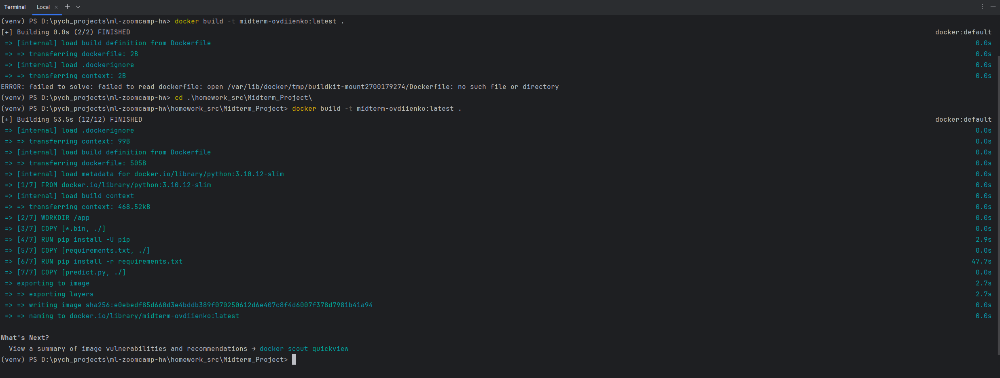
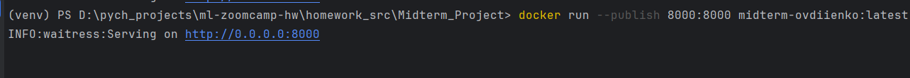
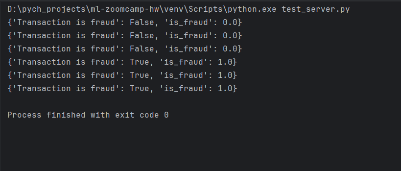

# My midterm project uses Credit Card Fraud Detection Dataset 2023
* source: https://www.kaggle.com/datasets/nelgiriyewithana/credit-card-fraud-detection-dataset-2023?select=creditcard_2023.csv
* description: This dataset contains credit card transactions made by European cardholders in the year 2023. It comprises over 550,000 records, and the data has been anonymized to protect the cardholders' identities. The primary objective of this dataset is to facilitate the development of fraud detection algorithms and models to identify potentially fraudulent transactions.
* Key Features:
  * id: Unique identifier for each transaction
  * V1-V28: Anonymized features representing various transaction attributes (e.g., time, location, etc.)
  * Amount: The transaction amount
  * Class: Binary label indicating whether the transaction is fraudulent (1) or not (0)
* I'll try to build model(s) to determine in transaction is fraudulent or not based on anonymized V parameters and amount.
* Notebook: midterm_proj.ipynb
* Need to download dataset from kaggle (cause github doesnt accept large files bigger as 100mb)
* Put csv inside credit_fraud_detection folder.

# How to check models locally:
* install packages: ```pip install -r requirements.txt```
* train models: ```python train.py```
* prediction: ```python predict.py```
  * test with http client and post VN parameters+ amount into 3 possible models:
    * /predict/lr for LogisticRegression
    * /predict/dtc for DecisionTreeClassifier
    * /predict/rcf for RandomForestClassifier
  * use test_server.py file as reference how to make requests and body structure.

# Local container run:
* Build image with:

```
docker build -t midterm-ovdiienko:latest .
```

* add tag to image
```
docker tag midterm-ovdiienko:latest midterm-ovdiienko:latest
```
* Run container with exposed port as in Dockerfile
``` 
docker run --publish 8000:8000 midterm-ovdiienko:latest
```

* Test endpoints
```
python test_server.py
```
